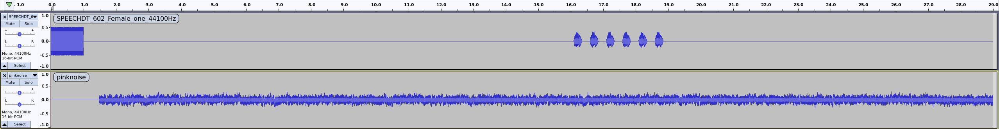
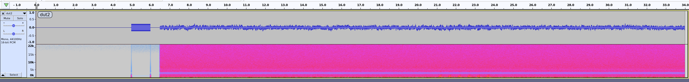
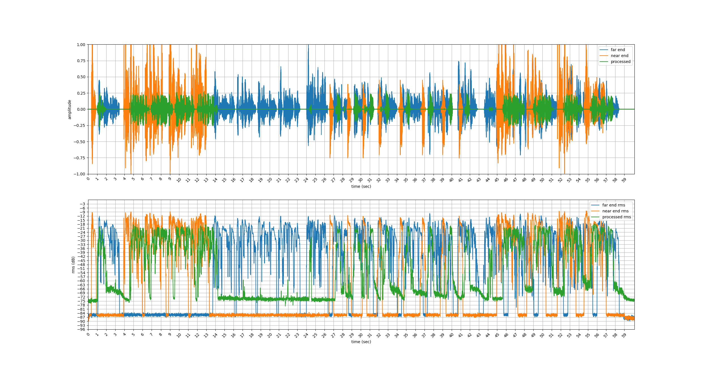
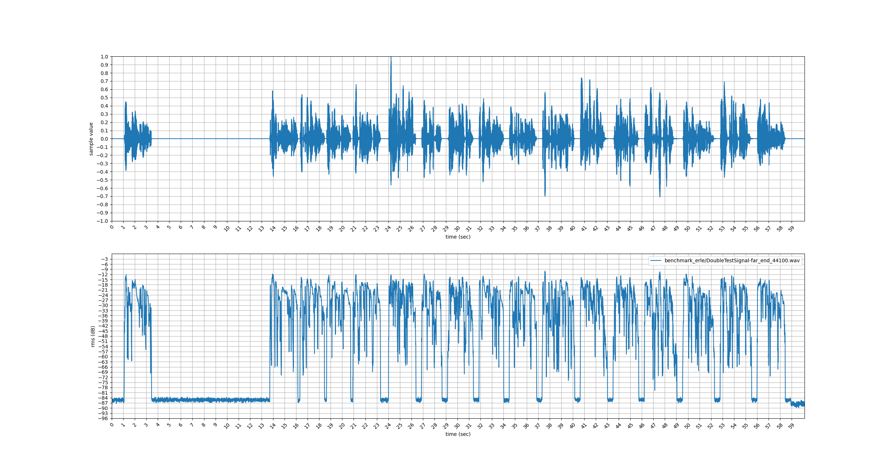

# Benchmark Tools
The package of `Benchmark Tools` is a collection of useful audio tools that help your experiment smooth.

## Installation
Please install required package first
```
pip install -r requirement.txt
```

# Tools
Note: if you don't know how use each tool, please execute `python <script name> -h`

## 1. Play, record pull wave file from DUT
An useful tool help you play, record, and pull audio wave files under a DUT. Use `-h` for more details.

```
Play, Record, and Pull audio

optional arguments:
  -h, --help            show this help message and exit
  --ip IP               camera ip address
  --username USERNAME   camera username, default: ubnt
  --password PASSWORD   camera password, default: ubntubnt
  --duration DURATION   recording duration when source file is not specified, default: 10.0
  --host_play_audio HOST_PLAY_AUDIO
                        source file / direcotry to be played on host, default: None
  --host_play_gain HOST_PLAY_GAIN
                        gain (dB) to be applied on the host wav file, default: 1.0
  --dut_play_audio DUT_PLAY_AUDIO
                        source file / direcotry to be played on dut, default: None
  --dut_play_gain DUT_PLAY_GAIN
                        gain (dB) to be applied on the dut wave file, default: 1.0
  --dest_folder DEST_FOLDER
                        destination folder, default: current working directory
  -c CHANNEL, --channel CHANNEL
                        channel number of recording

```
The parameter `host_play_audio` and `dut_play_audio` can be a file or directory. If any of them is set to a directory path, the `*.wav` file under that folder would be played.
The parameter `host_play_gain` and `dut_play_gain` can adjust the amplitude of audio files respectively.

* Linux:
```
python play_record_pull.py --ip=192.168.1.157 --username=ubnt --password=ubntubnt --dut_play_audio="./examples/play_record_pull/zh-TW/common_voice_zh-TW_18516087.wav"
```


* Windows:
```
python play_record_pull.py --ip=192.168.1.157 --username=ubnt --password=ubntubnt --dut_play_audio=".\examples\play_record_pull\zh-TW\common_voice_zh-TW_18516087.wav"
```


The program will play `./examples/play_record_pull/zh-TW/common_voice_zh-TW_18516087.wav` via default speaker of your computer, and then record on the DUT via ssh commands.
Finally, pull back the audio file under `dest_folder` folder.


## 2. Align

### Align single input file with target file

* Linux:
```
python align_wavfiles.py --target_file ./examples/benchmark_snr/clean/SPEECHDT_602_Female_one_44100Hz.wav --input_file ./examples/benchmark_snr/dut/dut.wav --output_file ./aligned.wav
```

* Windows:
```
python align_wavfiles.py --target_file .\examples\benchmark_snr\clean\SPEECHDT_602_Female_one_44100Hz.wav --input_file .\examples\benchmark_snr\dut\dut.wav --output_file .\aligned.wav
```

### Batch align the input folder with target file
* Linux:
```
python align_wavfiles.py --target_file="./source_file/Dyna-Src_P835_4_sentences_4convergence_16000Hz.wav" --batch_input_folder="/path/to/input_folder" --batch_output_folder="/path/to/output_folder"
```

* Windows:
```
python align_wavfiles.py --target_file=".\source_file\Dyna-Src_P835_4_sentences_4convergence_16000Hz.wav" --batch_input_folder="\path\to\input_folder" --batch_output_folder="\path\to\output_folder"
```

## 3. Benchmark SNR
```
usage: benchmark_snr.py [-h] [-s SPEECH_FILE] [-d DUT_FOLDER] [-c CONFIG] [-o OUTPUT]

A customized script for benchmark SNR experiment

optional arguments:
  -h, --help            show this help message and exit
  -s SPEECH_FILE, --speech_file SPEECH_FILE
                        clean speech source file
  -d DUT_FOLDER, --dut_folder DUT_FOLDER
                        DUT mic record folder
  -c CONFIG, --config CONFIG
                        timestamp config
  -o OUTPUT, --output OUTPUT
                        output folder
```

### Example
* Linux:
```
python benchmark_snr.py -s ./examples/benchmark_snr/clean/SPEECHDT_602_Female_one_44100Hz.wav -d ./examples/benchmark_snr/dut -c ./examples/benchmark_snr/clean/timestamp.csv -o ./examples/benchmark_snr/results
```

* Windows:
```
python benchmark_snr.py -s .\examples\benchmark_snr\clean\SPEECHDT_602_Female_one_44100Hz.wav -d .\examples\benchmark_snr\dut -c .\examples\benchmark_snr\clean\timestamp.csv -o .\examples\benchmark_snr\results
```

### More details
This script is customized for benchmark SNR experiment. For the experiment, the clean speech with pilot signal and noise are played by the host with the respective speaker, e.g. the speak speech and noise speaker.
Then, the degraded file are recorded by another computer.
This script is designed for offline `rms` calculation, not for data collection.

Assumption for clean speech signal:
* There is a pilot tone, following by the speech signal. We can use the pilot tone to align the `clean` source file and the `degrade` file.
  * No noise for the pilot tone period

  * Record file from DUT side

The script automatically align these files by correlation. Then it output the rms level of each session provided by `timestamp.csv`

Inputs for the script:
1. `--speech_file` points to the clean speech with the pilot
2. `--dut_folder` points to the collection dut record for benchmark
3. `--config`: the `timestamp.csv` exported from Audition, which marks the speech / noise period of the clean `speec_file`. Please refer to `./examples/benchmark_snr/clean/timestamp.csv` for example.

Output for the script:
1. `output` points to a folder where result csv and figures are stored.

```
examples/benchmark_snr/results
├── dut.csv
├── dut.png
└── dut2.png
```

## 4. Echo Return Loss Energy (ERLE) plotter
usage: erle_plotter.py [-h] [-f FAREND] [-n NEAREND] [-p PROCESSED]

* Linux:
```
python erle_plotter.py -f benchmark_erle/DoubleTestSignal-far_end_44100.wav -n benchmark_erle/DoubleTestSignal-near_end_44100.wav -p benchmark_erle/TouchMax_75dBC_SPK79dBC@50cm-2.wav
```
* Windows:
```
python erle_plotter.py -f benchmark_erle\DoubleTestSignal-far_end_44100.wav -n benchmark_erle\DoubleTestSignal-near_end_44100.wav -p benchmark_erle\TouchMax_75dBC_SPK79dBC@50cm-2.wav
```


## 5. Root Mean Square (RMS)
usage: rms [-h] [-v] [-f FRAME_SIZE] file [file ...]

Calculate the rms for the entire wave file
---
* Linux:
```
python rms benchmark_erle/DoubleTestSignal-far_end_44100.wav
```
* Windows:
```
python rms benchmark_erle\DoubleTestSignal-far_end_44100.wav
```
* result:
```
[rms] benchmark_erle/DoubleTestSignal-far end_44100.wav: -23.759493494843756
```

Visualize the rms versus time
---
* Linux:
```
python rms -v benchmark_erle/DoubleTestSignal-far_end_44100.wav
```
* Windows:
```
python rms -v benchmark_erle\DoubleTestSignal-far_end_44100.wav
```

